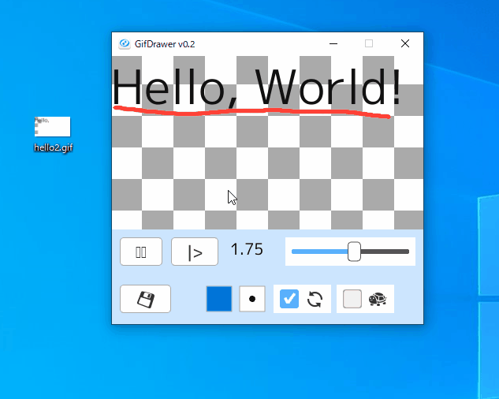
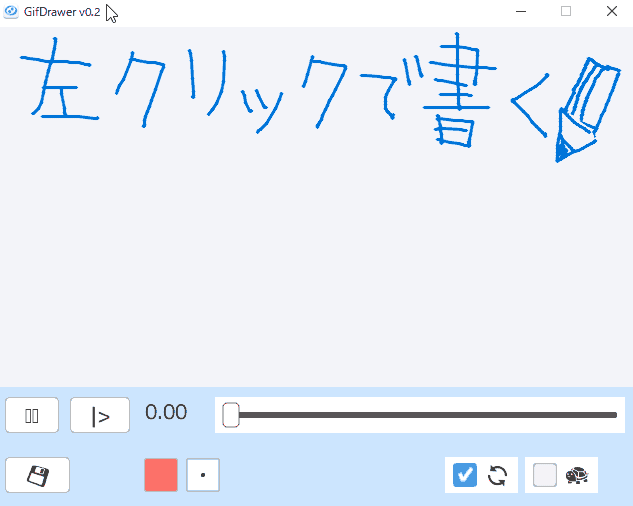
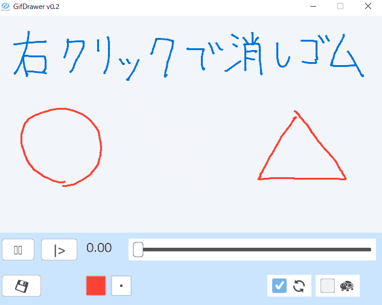
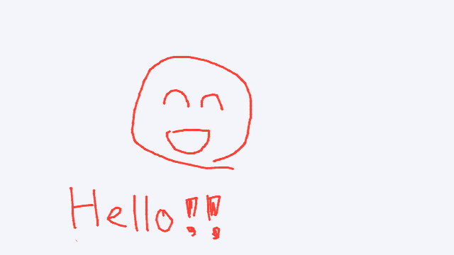
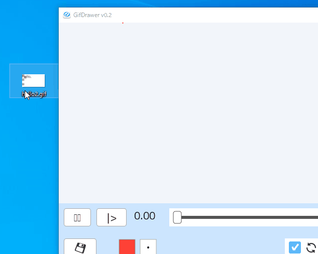
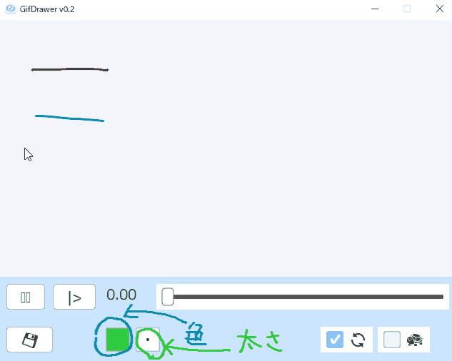
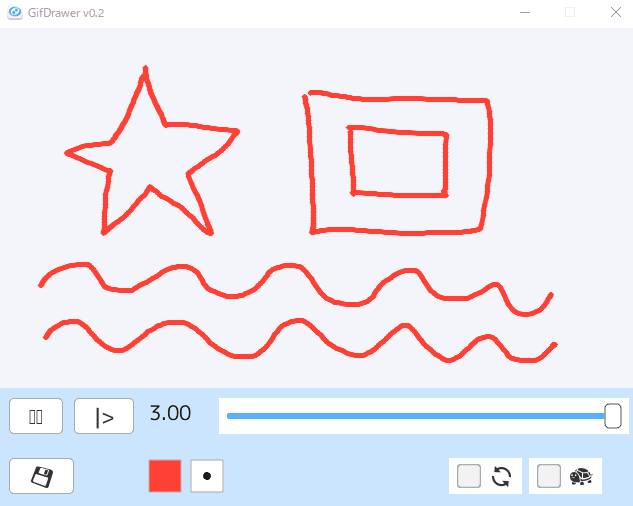

# GifDrawer
GIFアニメーションにお絵描き。



## インストール
このレポジトリをgit cloneすればすぐに使えます。  
または[tags](https://github.com/ongaeshi/GifDrawer/tags)から最新をダウンロード。

```
$ git clone https://github.com/ongaeshi/GifDrawer.git
```

## 使い方
### 1. 線を書く
マウス左クリックで線を書く。



### 2. 消しゴム
マウス右クリックで消しゴム。



### 3. 書いた線がアニメーションに
コマ送りを使うとアニメーションが作りやすい。


完成品。



### 4. gifアニメや画像を背景にする
gifアニメや画像ファイル(png, jpg)をドラッグ＆ドロップすると背景になります。  
アニメーションと連動したお絵描きを付けることができます。



### 5. ペンの色や太さの変更
クリックすると色や太さを変更できます。



### 6. アニメーションの保存
作成したアニメーションはgifアニメ形式で保存できます。



### 7. 作成したアニメーションの圧縮
GifDrawerフォルダ直下にあるbatファイルに.gifをドラッグ＆ドロップしてください。

※ PATHの通った場所にffmpeg.exeが必要です。

|  ファイル名  | 説明  | 出力ファイル名 |
| ---- | ---- | ---- |
|  GifCompress.bat    |  解像度を維持したままファイルサイズを圧縮  | INPUT.compressed.gif |
|  GifCompressShrink.bat        | 横幅を320pxに縮小しながらファイルサイズを圧縮  | INPUT.compshrinked.gif |

## キーボードショートカット
|  キー  | 説明  |
| ---- | ---- |
|  SPACE    |  PLAY/STOP  |
|  →        |  TIME++  |
|  Ctrl + → |  TIME = end_time  |
|  ←        |  TIME--   |
|  Ctrl + ← |  TIME = 0  |
|  C        |  CHANGE COLOR  |
|  T        |  CHANGE THICKNESS  |
|  S        | SLOW PLAY |
|  F10      | LOOP TOGGLE |
|  F11      | UI TOGGLE |
