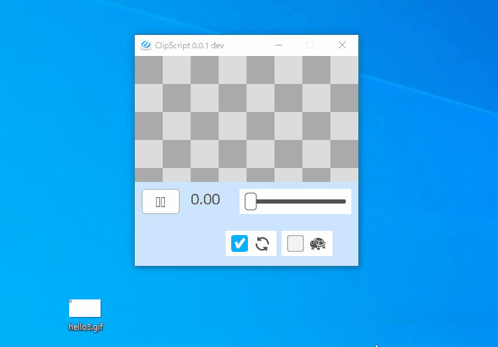

# GifDrawer
GIFアニメーションにお絵描き。

## 使い方
1. gifをドラッグ＆ドロップ
2. 再生/停止、スロー再生、コマ送り
3. マウスの左ボタンドラッグで線を書く
4. 書いた線はタイムラインと連動してアニメーションに

## キーボードショートカット
|  キー  | 説明  |
| ---- | ---- |
|  SPACE  |  PLAY/STOP  |
|  S      | SLOW PLAY |
|  →      |  TIME++  |
|  Ctrl + → |  TIME = end_time  |
|  ←      |  TIME--   |
|  Ctrl + ← |  TIME = 0  |